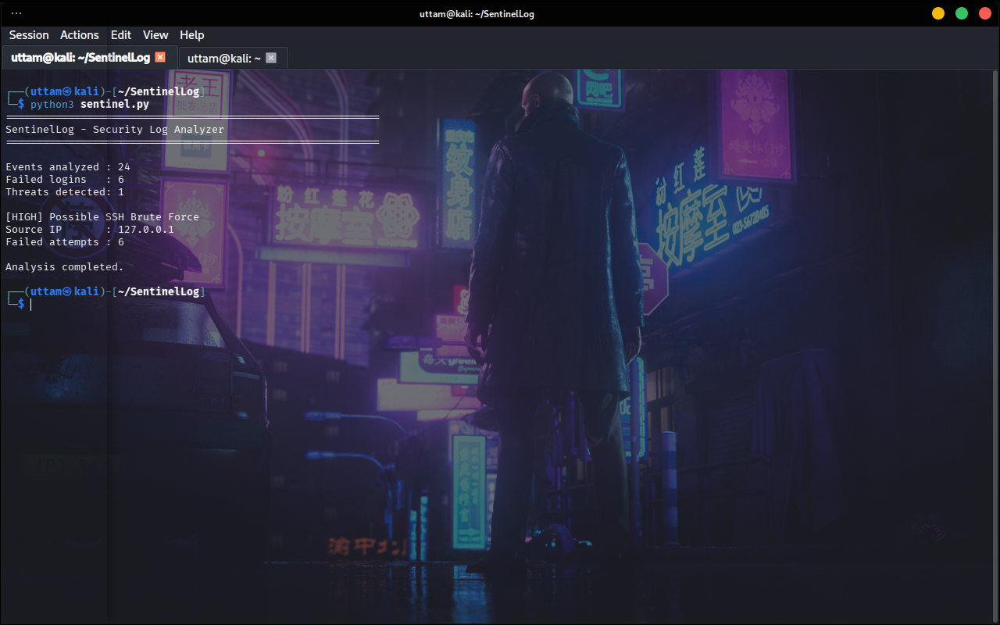
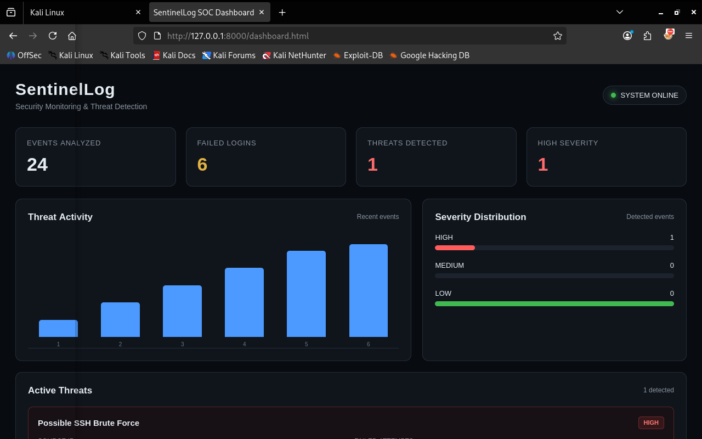
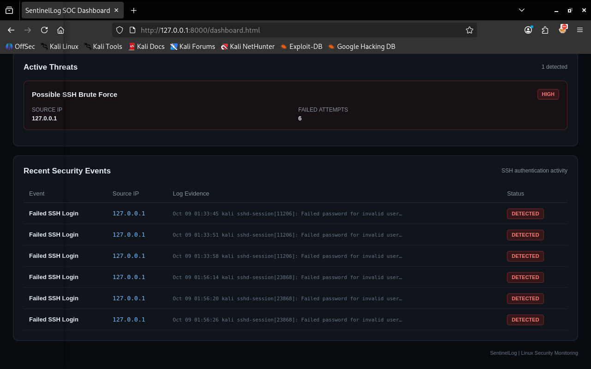

# SentinelLog

### Security Log Analysis & Threat Detection

SentinelLog is a Python-based security log analysis tool that analyzes Linux SSH authentication activity to identify suspicious login behavior and potential brute-force attacks.

The tool processes real systemd journal logs, extracts failed authentication events, correlates activity by source IP, and generates security findings based on repeated authentication failures.

Analysis results are exported as structured JSON data and visualized through a browser-based security monitoring dashboard.

---

## Features

- Linux SSH authentication log analysis
- Failed SSH login detection
- Source IP extraction
- Authentication event correlation
- SSH brute-force detection
- Severity-based threat classification
- JSON security report generation
- Security monitoring dashboard
- Threat activity visualization
- Security event and log evidence display

---

## How It Works

```text
Linux SSH Logs
      │
      ▼
  Log Collection
      │
      ▼
   Log Parsing
      │
      ▼
Event Extraction
      │
      ▼
Source IP Analysis
      │
      ▼
Threat Detection
      │
      ▼
JSON Report
      │
      ▼
Security Dashboard
```

---

## Detection Logic

SentinelLog analyzes failed SSH authentication events and groups them according to their source IP address.

When repeated failed authentication attempts are detected from the same source IP, the activity is classified as a potential SSH brute-force attempt.

### Current Detection Rules

| Detection | Condition | Severity |
|---|---|---|
| Failed SSH Login | Failed SSH password authentication | Event |
| Possible SSH Brute Force | 3 or more failed attempts from the same source IP | HIGH |

The detection is based on the actual authentication logs collected from the Linux system.

---

## Analysis Output

The following output shows SentinelLog analyzing SSH authentication activity and reporting detected security events.



---

## Security Monitoring Dashboard

SentinelLog provides a browser-based dashboard for visualizing analyzed security activity.

The dashboard displays:

- Total events analyzed
- Failed authentication attempts
- Detected threats
- High-severity findings
- Threat activity
- Severity distribution



---

## Threat Detection

Detected threats are displayed with relevant information including the source IP, number of failed attempts, and supporting log evidence.



---

## Technology Stack

- **Python 3** — Log analysis and detection engine
- **Linux systemd journal** — Security log source
- **SSH** — Authentication telemetry
- **JSON** — Structured security data
- **HTML5 / CSS3 / JavaScript** — Monitoring dashboard
- **Kali Linux** — Development and testing environment

---

## Project Structure

```text
SentinelLog/
├── sentinel.py
├── dashboard.html
├── reports/
│   └── dashboard_data.json
└── screenshots/
    ├── analysis-output.png
    ├── dashboard-overview.png
    └── threat-detection.png
```

---

## Installation & Usage

### Clone the Repository

```bash
git clone <repository-url>
cd SentinelLog
```

### Run SentinelLog

```bash
python3 sentinel.py
```

The analyzer reads SSH authentication events from the Linux systemd journal and generates:

```text
reports/dashboard_data.json
```

### Start the Dashboard

```bash
python3 -m http.server 8000
```

Open the dashboard in your browser:

```text
http://127.0.0.1:8000/dashboard.html
```

---

## Example Detection

Example SSH authentication events:

```text
Failed password for invalid user fakeuser from 127.0.0.1
Failed password for invalid user fakeuser from 127.0.0.1
Failed password for invalid user fakeuser from 127.0.0.1
```

SentinelLog identifies the repeated authentication failures and generates a high-severity finding:

```text
HIGH
Possible SSH Brute Force

Source IP: 127.0.0.1
Failed Attempts: 3
```

---

## Security Concepts Demonstrated

This project demonstrates practical implementation of:

- Security log analysis
- Authentication monitoring
- Event correlation
- Source IP analysis
- Threshold-based threat detection
- Security event classification
- Evidence-based detection
- JSON-based security reporting
- Security monitoring visualization

---

## Limitations

SentinelLog currently focuses on SSH authentication activity and the detection rules implemented in the project.

It is a lightweight security analysis project and is not intended to replace enterprise SIEM or centralized security monitoring platforms.

---

## Future Improvements

- Additional Linux security event detection
- Configurable detection thresholds
- More authentication anomaly rules
- Privilege escalation detection
- Support for additional log sources
- Advanced event correlation
- Automated alerting
- Expanded dashboard analytics
- Integration with centralized security monitoring platforms

---

## Author

**Uttam Dubey**

Cybersecurity | VAPT | Network Security | Security Monitoring
